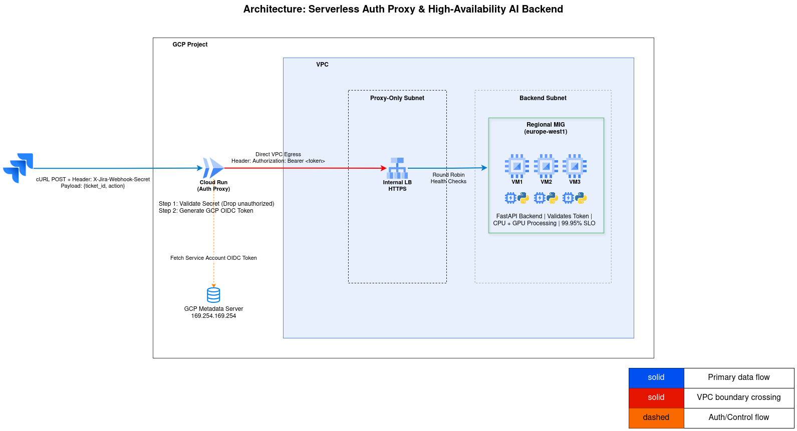

# GCP AI Service Integration - CI/CD & Infrastructure as Code

This repository contains the automated deployment pipeline and Infrastructure as Code (IaC) for integrating a Jira webhook with an internal AI backend hosted on Google Cloud Platform (GCP). 

The architecture uses a Regional Managed Instance Group (MIG) for the FastAPI backend and a Serverless Cloud Run authentication proxy for bursty ingress.

For demo reliability and low cost, this repository uses the cheapest practical backend VM profile (single `e2-micro` instance, no GPU). This avoids common quota/capacity blockers during hands-on runs.

## Architecture Overview




1. **Cloud Run (Auth Proxy):** Intercepts Jira webhooks, validates a custom secret via Google Secret Manager, and generates a GCP OIDC token.
2. **Internal HTTP Load Balancer:** Distributes private VPC traffic across multiple availability zones.
3. **Compute Engine MIG:** Hosts the Python/FastAPI AI application on low-cost, no-GPU instances (provisioned via startup scripts).

## How Application Code Is Deployed
1. **Proxy service (`app/proxy`)** is built into a container image in GitHub Actions (`deploy.yml`) and pushed to Artifact Registry.
2. **Backend service (`app/backend`)** is not containerized in this repo. Terraform injects `app/backend/startup.sh` as VM metadata startup script, and each MIG VM installs Python packages and starts FastAPI via systemd.
3. This split is intentional for this mock architecture:
   - Cloud Run requires a container image, so `app/proxy/Dockerfile` is mandatory.
   - The backend is on Compute Engine MIG, where startup scripts are sufficient for a mock/demo workload.

If you want deterministic backend application releases similar to proxy, package backend into an image and run it on GCE with Container-Optimized VM strategy or move backend to GKE/Cloud Run.

---

## Deployment Instructions

### Prerequisites
Before starting, ensure you have the following installed and authenticated on your local machine:
* [Google Cloud SDK (`gcloud`)](https://cloud.google.com/sdk/docs/install) - Authenticated with `gcloud auth login`.
* [GitHub CLI (`gh`)](https://cli.github.com/) - Authenticated with `gh auth login`.
* A valid GCP Project with billing enabled.

### Step 1: Bootstrap the Environment
To avoid "chicken-or-egg" deployment issues, a bootstrap script is provided to create the baseline resources required for the CI/CD pipeline (State Buckets, Artifact Registry, CI/CD Service Account, and GitHub Secrets).

1. Clone this repository and navigate to the root directory.
2. Make the script executable:
   ```bash
   chmod +x bootstrap.sh
   ```
3. Run the bootstrap script:
   ```bash
   ./bootstrap.sh
   ```
   *Note: The script will prompt you to enter the Jira Webhook Secret you want to use. It will automatically inject this securely into your GitHub Repository Secrets.*

### Step 2: Terraform State Bucket Configuration
The deploy workflow injects the backend bucket dynamically during `terraform init` using the `TF_STATE_BUCKET` GitHub secret.

1. For CI/CD deployment, no edit in `terraform/providers.tf` is required.
2. For local Terraform runs, initialize with:
   ```bash
   terraform init -backend-config="bucket=<YOUR-STATE-BUCKET>"
   ```

### Step 3: Trigger the Pipeline
1. Commit your changes.
2. Push to your repository.
3. Open **Actions** -> **Deploy AI Architecture**.
4. Click **Run workflow** (this workflow is `workflow_dispatch` and does not auto-run on push).
5. Approve the protected `production` environment when prompted, then wait for apply to finish.

### Fork-Friendly Deployment Checklist
To make this deploy reliably from a fork/new repo:
1. Ensure GitHub Actions is enabled for the fork.
2. Run `./bootstrap.sh` from the forked local checkout connected to your fork remote.
3. Confirm these repository secrets exist: `GCP_PROJECT_ID`, `GCP_SA_KEY`, `TF_VAR_jira_webhook_secret`, `TF_STATE_BUCKET`.
4. Ensure GCP billing is enabled and required APIs are enabled in the target project.
5. Run the deploy workflow manually from Actions.

---

## Testing & Verification

Once the GitHub Actions pipeline completes successfully, navigate to the GCP Console -> **Cloud Run** to find the public URL of your newly deployed `jira-auth-proxy` service.

You can test the end-to-end flow from your local terminal using the following `cURL` command (replace `<YOUR_CLOUD_RUN_URL>` with your actual URL, and the secret if you customized it during bootstrap):

**Test Success (Valid Secret):**
```bash
export CLOUD_RUN_URL="$(gcloud run services describe jira-auth-proxy --region=europe-west1 --format='value(status.url)')"
curl -X POST $CLOUD_RUN_URL/webhook \
  -H "Content-Type: application/json" \
  -H "X-Jira-Webhook-Secret: my-secret-123" \
  -d '{"ticket_id": "PROJ-994", "action": "summarize_rca"}'
```
*Expected Output:* `{"status":"200 OK","message":"AI Action 'summarize_rca' completed for ticket PROJ-994"}`

**Test Failure (Invalid Secret):**
```bash
export CLOUD_RUN_URL="$(gcloud run services describe jira-auth-proxy --region=europe-west1 --format='value(status.url)')"
curl -X POST $CLOUD_RUN_URL/webhook \
  -H "Content-Type: application/json" \
  -H "X-Jira-Webhook-Secret: WRONG-PASSWORD" \
  -d '{"ticket_id": "PROJ-994", "action": "summarize_rca"}'
```
*Expected Output:* `{"detail":"Unauthorized: Invalid Webhook Secret"}`

### Additional Backend Verification
Because backend runs in a private MIG behind an Internal LB, direct public access is not expected. Validate backend health indirectly through the successful webhook test above, and by checking the backend MIG instances are healthy in GCP Console.

## Cleanup

To avoid unexpected GCP charges, you must cleanly tear down the infrastructure when you are finished.

1. **Destroy the Infrastructure (Via GitHub Actions):**
   * Navigate to the **Actions** tab in your GitHub repository.
   * On the left sidebar, click on the **Destroy AI Architecture** workflow.
   * Click the **Run workflow** dropdown on the right side and execute it. 
   * *Wait for this pipeline to complete successfully. It will execute `terraform destroy` to remove the Load Balancer, VMs, and Cloud Run proxy.*

2. **Destroy the Bootstrap Resources (Local):**
   Once the GitHub Actions destroy pipeline finishes, run the local teardown script to delete the foundational resources (Terraform State Bucket, Artifact Registry, and CI/CD Service Account).
   ```bash
   chmod +x teardown.sh
   ./teardown.sh
   ```

## Potential Improvements

- Replace long-lived service account key authentication with GitHub OIDC + GCP Workload Identity Federation (short-lived credentials).
- Keep key-based auth in this version to ensure reproducible setup in constrained learning environments where billing/organization IAM permissions for WIF may be unavailable.
- Future work: add an OIDC-first bootstrap path with automatic fallback to the current key-based approach.